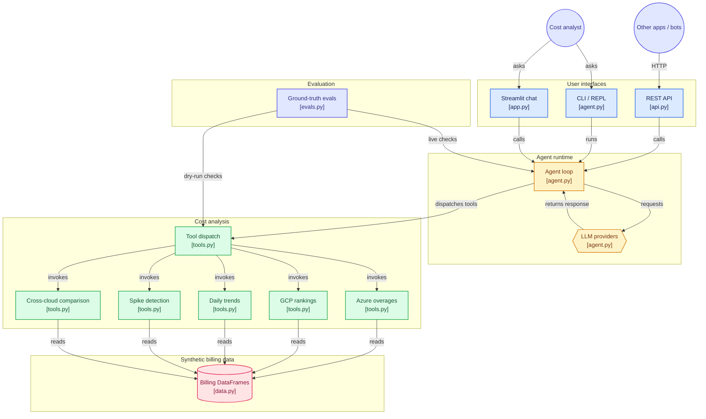

# obs-agent — Multi-Cloud Cost Triage Agent

An LLM-powered agent that answers natural-language questions about cloud logging costs across **Azure** and **GCP**. Instead of digging through spreadsheets, you ask: *"Which Azure subscription has the highest overage?"* — and the agent calls tools, gathers data, and gives you a concise answer.

Default provider is local **Ollama** (free, no API key). Also supports **DeepSeek**, **OpenAI** and **Anthropic (Claude)** — switch with a single `--provider` flag.

Built as a demonstration of the AI engineering agent pattern: tool definitions, tool dispatch, streaming output, a conversational REPL with multi-turn memory, a scripting CLI, a web UI, and an eval harness with ground-truth checks against deterministic synthetic data.

## What it does

Ask questions in plain English and get answers grounded in actual numbers:

```
"Which Azure subscription has the highest overage cost?"
"Show me the top 3 most expensive GCP projects"
"Compare costs across Azure and GCP"
"Has subscription sub-a1b2c3d4 had any cost spikes recently?"
"What's the daily trend for project-bravo?"
```

The agent decides which tools to call, executes them against the billing data, and summarises the findings — concisely, with actual dollar figures.

## Quick start

```bash
# 1. Clone and set up
git clone https://github.com/redbarron23/obs-agent.git && cd obs-agent
python -m venv .venv && source .venv/bin/activate
pip install -r requirements.txt

# 2. Start Ollama and pull a tool-capable model (default), or set a provider API key
#    ollama serve & ollama pull qwen2.5:7b
#    export DEEPSEEK_API_KEY=sk-...   # then add --provider deepseek

# 3. Generate synthetic data and run the interactive REPL
python agent.py

# 4. Or ask a single question (scriptable)
python agent.py -q "Which Azure subscription has the highest overage?" --verbose

# 5. Or launch the web UI
streamlit run app.py
```

## Features

### Streaming output

Watch tokens arrive in real-time instead of waiting for the full response:

```bash
python agent.py -q "Compare costs across Azure and GCP" --stream
```

Streaming works through the full tool-use loop — if the model calls a tool mid-stream, it prints text up to that point, executes the tool, and continues streaming.

### Multi-turn conversation memory

The REPL and web UI remember previous turns. Ask follow-up questions naturally:

```
You: Which Azure subscription has the highest overage?
Agent: sub-a1b2c3d4 at $18,411...

You: Show me its daily trend
Agent: (remembers which subscription you meant and fetches the trend)
```

Message history prunes at 20 turns to stay within context limits, keeping the first user message for original context.

### Cross-cloud cost comparison

A single tool that sums costs across both clouds and provides per-subscription and per-project breakdowns:

```
Cross-Cloud Cost Summary (30 days)
========================================
Azure total overage cost:  $23,059.00
GCP total logging cost:    $21,705.00
────────────────────────────────────────
Grand total:               $44,764.00
```

### Web UI (Streamlit)

```bash
streamlit run app.py
```

Opens a chat interface in your browser with provider/model selection, conversation history, and example prompts. Multi-turn memory works natively.

### REST API (FastAPI)

The agent is also available as a standalone HTTP service, so other apps (dashboards, chat bots, pipelines) can call it without importing any Python:

```bash
uvicorn api:app --reload          # http://localhost:8000/docs for interactive OpenAPI docs
```

| Endpoint | Purpose |
|---|---|
| `POST /ask` | `{"question", "provider"?, "model"?, "session_id"?}` → `{"answer", "session_id", "tools_called", ...}` |
| `POST /ask/stream` | Same request, answer streamed as server-sent events (`token` events, then `done` with `tools_called`, or `error`) |
| `GET /providers` | Supported providers and default models |
| `GET /health` | Liveness probe (always open) |
| `DELETE /sessions/{id}` | Forget a conversation |

```bash
curl -s localhost:8000/ask -H 'content-type: application/json' \
  -d '{"question": "Which Azure subscription has the highest overage?", "session_id": "demo"}'
# follow-ups reuse the same session_id and keep conversation memory
```

#### Streaming format

`POST /ask/stream` responds with `text/event-stream`: one `data:` line per text chunk, then a final `done` (or `error`) event.

```
data: {"token": "The top 3 GCP projects "}
data: {"token": "are Alpha, Bravo and Charlie."}

event: done
data: {"session_id": "demo", "tools_called": ["get_gcp_top_projects"]}
```

If the backend fails after the stream has started, the last event is `event: error` with `{"detail": "..."}` instead of `done`.

#### Errors

| Status | Meaning |
|---|---|
| `401` | Missing or wrong `X-API-Key` (only when `OBS_AGENT_API_KEY` is set) |
| `404` | `DELETE /sessions/{id}` for an unknown session |
| `422` | Invalid body (empty question, over 4000 chars) or unknown provider |
| `502` | The LLM backend failed: bad key, no credits, Ollama not running |

All error bodies are `{"detail": "..."}`. Interactive docs with schemas and examples are at `/docs` (Swagger UI) and `/redoc`; the raw spec is at `/openapi.json`.

#### Calling it from Python

```python
import json
import requests

BASE = "http://localhost:8000"
HEADERS = {"X-API-Key": "..."}          # omit if OBS_AGENT_API_KEY is not set

# One-shot, with conversation memory via session_id
r = requests.post(f"{BASE}/ask", headers=HEADERS, json={
    "question": "Which Azure subscription has the highest overage?",
    "session_id": "demo",
})
r.raise_for_status()
print(r.json()["answer"], r.json()["tools_called"])

# Streaming
with requests.post(f"{BASE}/ask/stream", headers=HEADERS, stream=True, json={
    "question": "And the second GCP project?", "session_id": "demo",
}) as resp:
    event = "message"
    for line in resp.iter_lines(decode_unicode=True):
        if line.startswith("event:"):
            event = line[7:]
        elif line.startswith("data:"):
            data = json.loads(line[6:])
            if event == "message":
                print(data["token"], end="", flush=True)
            elif event == "error":
                raise RuntimeError(data["detail"])
            else:                        # done
                print("\ntools:", data["tools_called"])
```

#### Running it in production

- **Sessions are in memory** (LRU, 200 max) and lost on restart. Run a single replica, or put sticky sessions (by `session_id`) in front. For multiple replicas, move `SessionStore` to Redis.
- **Set `OBS_AGENT_API_KEY`** whenever the port is reachable by anything but you. `/health` stays open for load-balancer probes.
- **Behind a gateway** (AWS API Gateway, Azure APIM, nginx): the service is plain HTTP/JSON plus SSE. Disable response buffering and use a long idle timeout on `/ask/stream`, or tokens arrive in one burst. Local models can take a minute for a multi-tool question.
- **Provider keys** go in environment variables (`.env` with Compose, a secret store elsewhere), never in requests.
- **Request size and cost:** questions are capped at 4000 characters, but there is no built-in rate limit. Add one at the gateway.

### Docker

```bash
cp .env.example .env              # add keys for hosted providers (optional)
ollama serve                      # default provider runs on the host
docker compose up --build         # API on :8000, Streamlit UI on :8501
```

Containers reach the host's Ollama through `host.docker.internal` (override with `OLLAMA_HOST`). The image runs as a non-root user and the API has a health check.

### CLI with scripting

```bash
# Single answer (for scripts, CI, or demos)
python agent.py -q "Show me the top 3 GCP projects"

# Stream mode
python agent.py -q "Any cost spikes?" --stream

# Verbose mode (see tool calls)
python agent.py -q "Compare costs" --verbose

# Specific model
python agent.py -q "Show me spikes" --model claude-sonnet-4-6
```

### Provider support

| Provider | Default model | Env variable |
|---|---|---|
| **Ollama** (local, default) | `qwen2.5:7b` | none — runs locally |
| **DeepSeek** | `deepseek-chat` | `DEEPSEEK_API_KEY` |
| **Anthropic** | `claude-sonnet-4-6` | `ANTHROPIC_API_KEY` |
| **OpenAI** | `gpt-5.4-mini` | `OPENAI_API_KEY` |

Switch providers:
```bash
# Use Anthropic instead of Ollama
python agent.py --provider anthropic -q "Which Azure subscription has the highest overage?"

# Pick a specific Ollama model (no API key needed)
python agent.py --model qwen2.5:7b -q "Compare Azure and GCP"
```

The provider abstraction (`Provider` class in `agent.py`) wraps both APIs behind a common interface, so tool logic and the agent loop work identically regardless of backend.

## Architecture

```
obs-agent/
├── app.py                # Streamlit web UI (chat interface with provider/model selection)
├── api.py                # FastAPI REST service (/ask, /ask/stream, sessions, optional API key)
├── agent.py              # Agent loop + CLI (REPL / --question) + streaming + provider abstraction
├── tools.py              # 5 tool functions + LLM tool definitions + dispatch table
├── data.py               # Deterministic synthetic data generator (seeded RNG, no CSVs needed)
├── evals.py              # 8 eval cases with ground-truth checks against the synthetic data
├── tests/
│   ├── conftest.py       # Shared fixtures
│   ├── test_agent.py
│   ├── test_api.py
│   ├── test_evals.py
│   └── test_tools.py
├── .github/workflows/
│   └── ci.yml            # Unit tests + deterministic eval dry-run
├── Dockerfile
├── docker-compose.yml   # API on :8000 + Streamlit UI on :8501
├── .env.example
├── pyproject.toml
├── requirements.txt
├── requirements-dev.txt
├── LICENSE
└── README.md
```

```
You ──question──▶  agent.py  ──tools──▶  tools.py  ──data──▶  data.py
                    │                                              │
                    │  (LLM API loop)                             (in-memory
                    │   tool_use ↔ end_turn                       DataFrames)
                    │   streaming supported
                    │   conversation memory persists
                    │
                    ▼
               answer (printed / streamed / rendered in web UI)
```

### Architecture diagram



### The agent loop (`agent.py`)

The standard tool-use pattern:

1. Send the user's question + tool definitions to the model
2. If the model requests a tool, execute it via `TOOL_DISPATCH` and feed the result back
3. Repeat until the model produces a final answer

Supports both **batch** (full response at once) and **streaming** (token-by-token) modes. The `Provider` class abstracts over Anthropic and OpenAI-compatible (DeepSeek) APIs, handling differences in request format, response shape, and stop-reason naming.

### The tools (`tools.py`)

| Tool | Purpose |
|---|---|
| `get_azure_top_overages` | Top N Azure subscriptions by estimated 30-day overage cost |
| `get_gcp_top_projects` | Top N GCP projects by total logging cost |
| `get_daily_trend` | Day-by-day cost/ingestion trend for a given subscription or project |
| `find_spikes` | Detects days where cost jumped >X% vs the previous day (both clouds) |
| `compare_cross_cloud` | Total cost comparison across Azure and GCP with per-sub/project breakdown |

Each tool returns a clean formatted string so the model gets compact, readable results. Tools are pure functions operating on in-memory DataFrames — no network calls, no side effects.

### The data (`data.py`)

Generates 60 days of realistic multi-cloud billing data with a fixed random seed (42):

- **5 Azure subscriptions** with varying ingestion/overage levels — one dominant, one near-zero
- **5 GCP projects** with different cost profiles
- **Built-in cost spikes**: `sub-a1b2c3d4` spikes to $45 on day 30, `project-bravo` spikes to $28 on day 20
- **Deterministic**: every run produces the same IDs, costs, and patterns, so evals always pass

No external CSVs required. The project runs entirely from synthetic in-memory data. To use real billing data, swap the DataFrames in `data.py` — the rest of the code doesn't care where the data comes from.

Key identifiers in the synthetic data:

| Cloud | Subscriptions / Projects | Known spike |
|---|---|---|
| Azure | `sub-a1b2c3d4` (dominant, $18,411 overage), `sub-e5f6g7h8`, `sub-i9j0k1l2`, `sub-m3n4o5p6`, `sub-q7r8s9t0` (near-zero) | Day 30: $45 → triggered by `--threshold 50`
| GCP | `project-alpha` (highest, $12,672), `project-bravo`, `project-charlie`, `project-delta`, `project-echo` (lowest) | Day 20: $28

## Run the evals

```bash
# Deterministic dry-run — checks tool outputs directly, no API key needed
python evals.py --dry-run

# Live evals against the LLM (needs the provider's API key; default: Ollama)
python evals.py
python evals.py --provider anthropic --model claude-haiku-4-5-20251001

# Verbose output for every case
python evals.py --dry-run -v
```

Dry-run mode calls the tools directly and verifies ground-truth identifiers appear in the output — fully deterministic, suitable for CI. Live mode runs the full agent loop and checks that the LLM's answer contains the expected facts.

This runs 8 eval cases with known-correct answers and checks that the agent's response contains the expected identifiers. Covers all five tools:

- Azure top overage, GCP top project, GCP top 3
- Daily trends (Azure and GCP)
- Spike detection (Azure and GCP)
- Multi-cloud summary

Because LLM output is non-deterministic, evals check for **presence of correct facts** (`must_contain`) rather than exact-string matching — the right testing strategy for AI systems.

## Design decisions

### Why synthetic in-memory data?

Real billing CSVs contain sensitive subscription IDs and project names. Using deterministic synthetic data means:

- The project runs with zero setup beyond `pip install`
- Evals are reproducible — they pass or fail deterministically
- No risk of committing credentials or PII to version control
- Anyone can clone and run it immediately

### Why fact-presence checks instead of exact matching?

Most software lets you write deterministic tests. Agent behaviour is non-deterministic — the same question can get different phrasings. The eval harness in this project shows the right testing strategy for this world: check that *correct facts* appear in the output, not that the exact wording matches.

### Why a provider abstraction?

Building API-agnostic agents is a practical skill for production systems where provider lock-in is a concern. The `Provider` class in `agent.py` shows how to switch between Anthropic and OpenAI-compatible backends without changing the tool logic or agent loop.

## What this project demonstrates

| Concept | Implementation |
|---|---|
| **Agent loop** | Provider-agnostic request → dispatch → feed-back cycle until `end_turn` |
| **Streaming** | Token-by-token output through the full tool-use loop (Anthropic + OpenAI SSE) |
| **Conversation memory** | Multi-turn REPL with history pruning at 20 messages |
| **Provider abstraction** | `Provider` class wrapping Anthropic and OpenAI-compatible APIs |
| **Tool definitions** | JSON Schema input specs that the model calls dynamically |
| **Tool dispatch** | `TOOL_DISPATCH` dict mapping tool names to Python functions |
| **CLI** | REPL for interactive use + `--question` / `--stream` / `--model` / `--provider` flags |
| **Web UI** | Streamlit chat interface with provider/model selection |
| **Evals** | Fact-presence checks (`must_contain`) instead of brittle exact-string matching |
| **Deterministic test data** | Seeded RNG for reproducible dev, test, and CI |

## Requirements

- Python 3.10+
- **Ollama** (default): no API key needed — install Ollama and pull a tool-capable model
- **DeepSeek / OpenAI / Anthropic** (optional): `DEEPSEEK_API_KEY` / `OPENAI_API_KEY` / `ANTHROPIC_API_KEY`

### Dependencies

Runtime (`requirements.txt`):

```
anthropic>=0.50.0
openai>=1.0.0
streamlit>=1.28.0
pandas>=2.0.0
numpy>=1.24.0
```

Dev/test (`requirements-dev.txt`):

```
pytest>=8.0.0
```

## Testing

Unit tests and deterministic eval dry-runs:

```bash
pip install -r requirements-dev.txt
python -m pytest tests/ -v

# Skip live LLM evals (default in CI)
python -m pytest tests/ -v -m "not integration"

# Run live evals (requires ANTHROPIC_API_KEY)
python -m pytest tests/ -v -m integration
```

CI runs on every push/PR via GitHub Actions (Python 3.10–3.12): unit tests + eval dry-run.

### Test strategy

**Tool tests** (`tests/test_tools.py`, 29 tests) patch the module-level DataFrames with small, hand-crafted fixtures containing known values:

```python
# conftest.py — fixtures with transparent data
@pytest.fixture
def azure_summary():
    return pd.DataFrame([
        {"subscription_id": "sub-a", "estimated_overage_cost_30d": 5000},
        {"subscription_id": "sub-b", "estimated_overage_cost_30d": 2000},
        ...
    ])

# test_tools.py — verifies logic, not API behaviour
def test_top_1(self, patch_azure_summary):
    result = get_azure_top_overages(n=1)
    assert "sub-a" in result
    assert "sub-b" not in result  # only top 1
```

**Agent tests** (`tests/test_agent.py`, 32 tests) mock the Provider class so no API calls are made:

```python
# Helper builds a fake Anthropic response with known content
resp = make_anthropic_response(
    tool_name="get_azure_top_overages",
    tool_input={"n": 1},
)

with patch("agent.Provider.create", return_value=resp):
    answer, messages = run("Which Azure sub is top?")

assert "sub-a" in answer
```

Both API shapes (Anthropic and OpenAI-compatible) are tested via helper factories that build correctly-shaped fake responses. The streaming path also has dedicated tests for tool-call-through-streaming.

### File layout

```
tests/
├── conftest.py        # Shared fixtures — tiny DataFrames with known values
├── test_tools.py      # Tool logic tests — pure pandas, no API calls
├── test_agent.py      # Agent loop tests — mocked LLM, covers all agent paths
└── test_evals.py      # Eval dry-run (deterministic) + live integration tests
```

| Group | Tests | What's verified |
|---|---|---|
| Tool logic (`test_tools.py`) | 29 | Top-N ranking, zero filtering, spike thresholds, cross-cloud totals, edge cases |
| Agent loop (`test_agent.py`) | 16 | Simple answer, single/multi tool call, conversation memory, history pruning, empty/long questions |
| Provider abstraction | 10 | Stop reason mapping + content block parsing for Anthropic and OpenAI shapes |
| Streaming | 3 | Streaming with/without tools, OpenAI-compatible streaming |
| CLI parsing | 8 | All flags, defaults, combinations |

## Sample conversations

All examples use the synthetic data (seed 42) so you get identical output. Run them yourself:

### Single question with streaming

```bash
python agent.py -q "Which Azure subscription has the highest overage cost?" --stream
```

Live output (streaming, token by token):

```
The Azure subscription with the highest overage cost is **sub-a1b2c3d4**, with an estimated
overage cost of **$18,411.00** over the last 30 days. It ingested 42.8 GB of log data,
with 3.7 GB exceeding its allocation.
```

### Verbose mode (see tool calls)

```bash
python agent.py -q "Find cost spikes in the last 60 days" --verbose
```

```
  [stop_reason: tool_use]
  [tool: find_spikes({'threshold_pct': 200})]
  [tool result: find_spikes({'threshold_pct': 200})]
  [stop_reason: end_turn]

Spikes detected (both clouds):

[Azure]
  • sub-a1b2c3d4 — day 30: $45.00 (+350% vs $10.00 previous day)

[GCP]
  • project-bravo — day 20: $28.00 (+180% vs $10.00 previous day)
```

### Multi-turn conversation (REPL)

```
$ python agent.py
obs-agent — Multi-Cloud Cost Triage Agent
Provider: anthropic  |  Model: claude-sonnet-4-6  |  Mode: batch  |  Type 'quit' to exit.

You: Which GCP project costs the most?
Agent: **project-alpha** is the most expensive at **$12,672.00** over the past 30 days.

You: Show me its daily trend
Agent: (remembers you mean project-alpha, fetches the trend)

Daily cost trend for project-alpha:
  Day        Cost
  ─────────────────
  2026-05-01   $42.00
  2026-05-02   $38.00
  ...
  2026-06-29   $45.00

You: How does that compare to Azure's total?
Agent: Let me look at both clouds together...

Cross-Cloud Cost Summary (30 days)
========================================
Azure total overage cost:  $23,059.00
GCP total logging cost:    $21,705.00
────────────────────────────────────────
Grand total:               $44,764.00
```

### DeepSeek as provider

```bash
export DEEPSEEK_API_KEY=sk-...
python agent.py --provider deepseek --model deepseek-chat -q "Top 3 GCP projects" --verbose
```

### Ollama (local)

```bash
# Make sure Ollama is running with a model that supports tools
# (qwen2.5, llama3.1, etc.)
ollama pull qwen2.5:7b

# Run the agent — no API key needed
python agent.py --provider ollama --model qwen2.5:7b -q "Compare costs across Azure and GCP"

# Stream mode works too
python agent.py --provider ollama --model qwen2.5:7b -q "Any cost spikes?" --stream --verbose

# Custom host (if Ollama isn't on localhost)
export OLLAMA_HOST=http://my-server:11434
python agent.py --provider ollama --model qwen2.5:7b -q "Which Azure sub has the highest overage?"
```

### Web UI example prompts

Launch `streamlit run app.py`, select your provider, and try:

- *"Which Azure sub costs the most?"*
- *"Show me top 3 GCP projects"*
- *"Any recent cost spikes?"*
- *"What's the daily trend for sub-a1b2c3d4?"*
- *"Compare costs across both clouds"*

The web UI maintains conversation history between turns, so follow-ups like *"show me its daily trend"* work naturally. Enable **Stream responses** in the sidebar to watch tokens arrive in real time.

## References

- [ChromaDB](https://www.trychroma.com/products/chromadb) — open-source vector database for embedding storage and similarity search
- [RAG 101: Demystifying Retrieval-Augmented Generation Pipelines](https://developer.nvidia.com/blog/rag-101-demystifying-retrieval-augmented-generation-pipelines/) — NVIDIA blog on RAG architecture, chunking strategies, and evaluation
- [Sentence Transformers](https://www.sbert.net/) — library and model hub for dense vector embeddings (`all-MiniLM-L6-v2`)
- [Evaluating RAG: A Comprehensive Guide to Metrics and Methods](https://www.rungalileo.io/blog/evaluating-rag-a-comprehensive-guide-to-metrics-and-methods) — Galileo guide covering dual-attribution eval (source + fact checks)
- [LangSmith RAG Evaluation](https://docs.smith.langchain.com/faq/evaluation/eval_rag) — production-grade RAG eval patterns (correctness, faithfulness, relevance)

## License

MIT — see [LICENSE](./LICENSE).

## Related projects

### [rag-observability](../rag-observability/) — RAG over Observability Docs

A standalone Retrieval-Augmented Generation system that answers natural-language questions about multi-cloud observability architecture, coverage targets, and monitoring standards. Built on real domain documentation.

```
Q: What is the coverage target for Tier 1 production resources?
A: The production Tier 1 coverage target is 90% within 6 months and 100%
   within 12 months (source: coverage-targets.md, section 'Tier 1').
```

**Pipeline:** `.md` documents → heading-aware chunking → `all-MiniLM-L6-v2` embeddings → ChromaDB vector store → cosine similarity retrieval → Claude with cited generation.

**Key differences from obs-agent:**

| Concern | obs-agent | rag-observability |
|---|---|---|
| **Pattern** | Tool-use agent (function calling) | RAG (retrieval + generation) |
| **Data** | Synthetic billing DataFrames | Real documentation (.md files) |
| **LLM role** | Decides which tools to call | Answers from retrieved context |
| **Memory** | Multi-turn conversation (20 msg history) | Stateless per query |
| **Eval focus** | Fact presence in answer | Source attribution + fact presence |
| **Providers** | Anthropic, DeepSeek, Ollama | Anthropic only |

**References:**
- [ChromaDB](https://www.trychroma.com/products/chromadb) — vector database
- [RAG 101: Demystifying RAG Pipelines](https://developer.nvidia.com/blog/rag-101-demystifying-retrieval-augmented-generation-pipelines/) — NVIDIA
- [Sentence Transformers](https://www.sbert.net/) — embedding models (`all-MiniLM-L6-v2`)
- [Evaluating RAG: Metrics and Methods](https://www.rungalileo.io/blog/evaluating-rag-a-comprehensive-guide-to-metrics-and-methods) — Galileo
- [LangSmith RAG Evaluation](https://docs.smith.langchain.com/faq/evaluation/eval_rag) — production eval patterns
